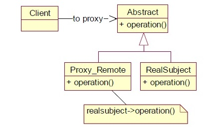

The proxy design pattern includes a new object, which is called “Proxy” in place of an existing object which is called the “Real Subject”. The proxy object created of the real subject must be on the same interface in such a way that the client should not get any idea that proxy is used in place of the real object. Requests generated by the client to the proxy are passed through the real subject.

