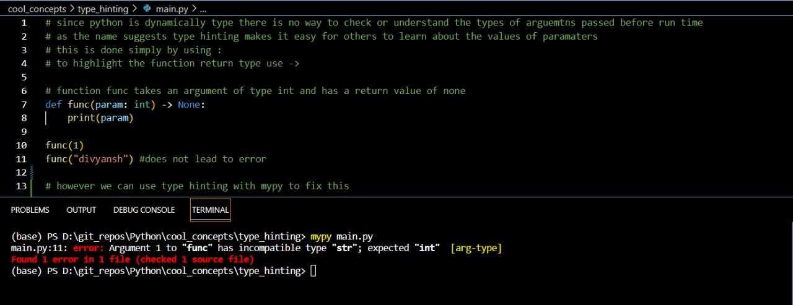

Type hints are performed using Python annotations (introduced since PEP 3107). They are used to add types to variables, parameters, function arguments as well as their return values, class attributes, and methods. Adding type hints has no runtime effect: these are only hints and are not enforced on their own.

